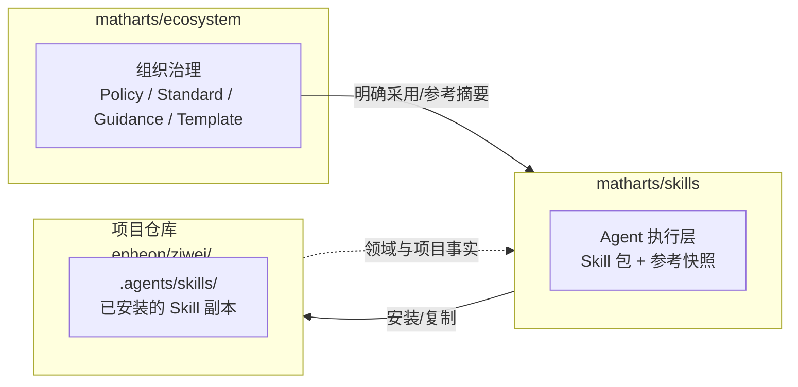
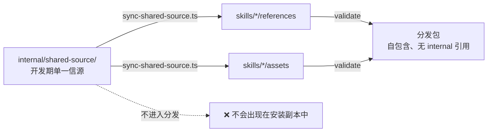
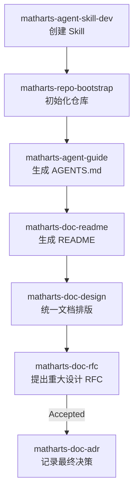
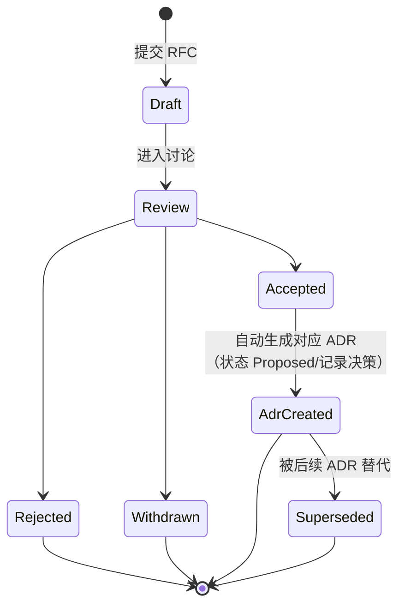
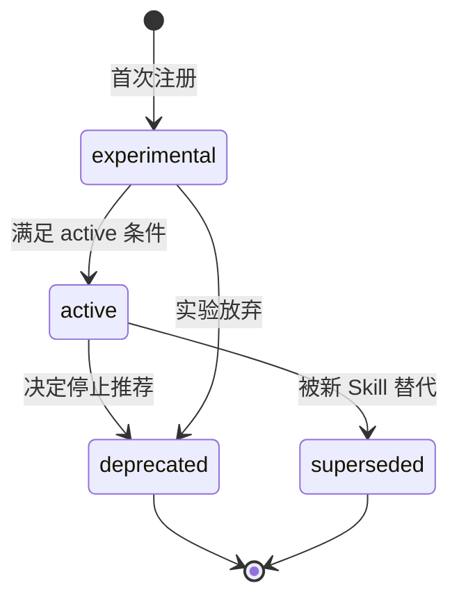
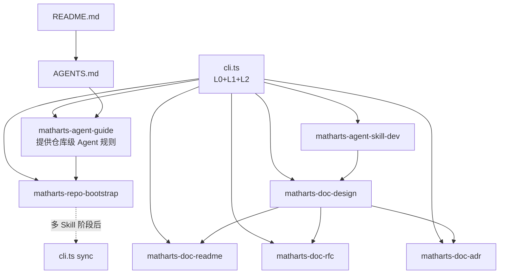
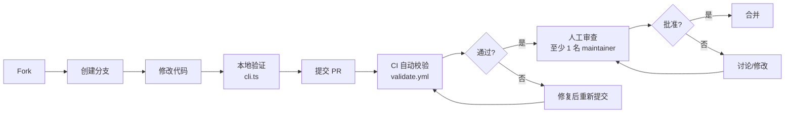

# MathArts Skills 仓库设计

本文档定义 `matharts/skills` 的仓库边界、Skill 包规范、分发机制和实施顺序，供维护者在设计、实现和评审变更时查阅。

| 属性        | 值                                   |
| ----------- | ------------------------------------ |
| 文档状态    | Draft                                |
| 版本        | 0.7.0                                |
| 评审目标    | 对齐 agentskills.io 与组织仓库边界   |
| 上次评审    | RFC-003：对齐 ecosystem 边界（Draft）    |

## 如何使用本文档

- 规划第一阶段工作时，先阅读“实施范围”，再按“第一阶段实施顺序”和“第一阶段验收标准”执行
- 新增或修改 Skill 时，重点查看“设计原则”“单个 Skill 的标准结构”和“`SKILL.md` frontmatter 设计”
- 评审兼容性、状态或发布流程时，查看“Skill 状态”“Skill 版本规则”和“Skill 测试策略”
- 追溯设计理由时，查看文末的“设计决策记录”

## 变更记录

<details>
<summary>查看 0.1.0 至 0.6.5 的变更</summary>

| 版本   | 日期         | 变更                                                                                              |
| ------ | ------------ | ------------------------------------------------------------------------------------------------- |
| 0.1.0  | 初稿         | 首版设计：定位、原则、7 个 Skill、仓库结构、版本规则                                              |
| 0.2.0  | 评审修订     | 文件名修正（DESGIN→DESIGN）；解决 `internal/shared-source` 矛盾；`skill.json` 增加 `dependencies`/`extends`；新增测试策略、向后兼容、状态转换条件、RFC→ADR 衔接、`categories.json` 定义、bootstrap/agents-md 边界；增加 Mermaid 图；精简重复内容 |
| 0.3.0  | 安装机制修订 | 删除自造的 `install-skill.ts` 与项目侧 `installed.json`；统一改用生态官方 CLI `npx skills` 安装并 `@<ref>` 锁版本；`dependencies`/`extends` 降级为声明性，写入 `AGENTS.md` Skills 段；`validate-skill.ts` 明确为仓库 QA 而非安装器 |
| 0.4.0  | 删除 registry | 删除 `registry/skills.json`、`registry/categories.json`、`tools/update-registry.ts` 及对应 schema；`skill.json` 作为唯一的 skill 元数据真相源；`npx skills` 的 directory-walk 自动发现取代集中注册表 |
| 0.4.1  | 评审后修订 | 修正 §17 编号；`extends` 改为数组并明确依赖解析算法；补充 `references/*.snapshot.md` 与正式标准边界、AGENTS.md Skills 段格式、`internal/` 单向同步、experimental 状态兼容承诺、npx skills 待验证提示、Phase 4 Skill 命名；新增术语表 |
| 0.5.0  | agentskills 合规 | 废除 `skill.json` 与 `VERSION`；全部元数据并入 `SKILL.md` YAML frontmatter；`metadata` 值强制为 string；新增渐进式披露原则、name 匹配目录名硬约束、description 写作指南、compatibility 替代 supported_agents；`validate-skill.ts` 改为调用官方 `skills-ref` + MathArts 自定义检查；§9/§11/§16/§17/§18 同步更新 |
| 0.5.1  | 规范对齐修补 | 修复 "ambassadors" 拼写错误；补全 `scripts/` 规范目录到 §3.2/§9；删除 §4.1 残留的"注册表"；§15 CHANGELOG.md 引用改为 README.md；`extends` 示例补充多值格式；新增 `metadata.internal` 字段；精简 description 示例触发词 |
| 0.5.2  | 文档清晰度改进 | §12 MathArts 扩展段补充说明"符合规范 metadata 允许任意 string→string 映射"；`metadata.internal` 描述从"agentskills 生态约定"修正为"vercel-labs/skills CLI 约定"；§6.3 表格下方添加简称注释（bootstrap/agents-md → 完整名称） |
| 0.5.3  | 第二轮评审修复 | 🔴 修复 §16 "两层"与四层测试表矛盾（改为"分层执行"）；修复 §5 错误交叉引用（删除对 §12 的引用）。🟡 更新"上次评审"字段至 0.5.2；§3.2 "至少包含"改为"完整结构包含"；§11 README.md 标注为"MathArts 要求"以区分规范强制项；§15 迁移指南位置统一为"README.md 或 references/CHANGELOG.md"；§18 统一使用 Skill 全名。🟢 §13 修复分号标点；§9 补全所有 Skill 目录内容列表；删除不存在的 tools/pyproject.toml 引用；补充 integrations/ 和根级 tests/ 用途注释；精简重复声明（§3.2、§12、§20 不再反复强调"不再有 skill.json 或 VERSION"） |
| 0.6.0  | 第三轮评审补充 | 🔴 §17 补充依赖关系图与并行可能性表格；§9 新增 CI/CD 工作流规格（validate.yml、release.yml）；新增 §22 贡献指南（PR 流程、审查标准、CLA、响应时间）；§14 新增废弃与替代流程（8 步操作、6 个月维护窗口、通知机制）。🟡 §3.4 新增同步失败处理（5 种场景 + 回滚机制）；§11 新增 scripts/ 安全规范（6 项要求 + 审查流程）；§12 新增 metadata 扩展治理（审批流程、命名规范、注册表）；§13 新增离线安装方案（3 种方案）；§15 新增预发布版本规范（Alpha/Beta/RC）；§16 新增快照维护（更新流程、责任分工、格式规范）。🟢 §6.6/6.7 补充 RFC/ADR 存储位置规范；§19 新增路线图时间线表格；§21 术语表补充 6 个术语；新增 §23 设计决策记录（5 个 ADR） |
| 0.6.1  | 第四轮评审修复 | 🔴 更新"上次评审"字段至第四轮；§3.4 子节"同步失败处理"编号为 3.4.1；§14 步骤 8 "从 registry 移除"改为"从仓库移除（归档至 deprecated/ 目录）"；§19 时间线从 2024-2026 更新至 2026-2027；§17 依赖图补充 AGENTS.md → agent-guide 依赖。🟡 §5 表格 Skill 名列对齐修正；§10 最小结构对齐修正；§14 "废弃与替代流程"编号为 14.1；§19 删除重复的 Phase 小节，合并为单表；§20 总结精简为原则列表；§23 ADR 删除变更历史 |
| 0.6.2  | 第五轮评审修复 | 🔴 更新"上次评审"字段至第五轮；§11 统一使用"agentskills.io 规范"术语；§11 依赖声明补充多语言支持（`package.json`）；§13 明确验证责任人为"仓库维护者"；§5 修正交叉引用描述；§6.2 简化 frontmatter 引用说明；§6.4 明确拓扑排序语义；§9 路径过滤补充 GitHub Actions 语法；§12 字段命名规范澄清历史遗留字段；§17 依赖图消除重复箭头；§19 Phase 5 前置条件具体化 |
| 0.6.3  | 第六轮评审优化 | 新增"实施优先级指南"章节，标记各章节实施优先级（必需/可选）；§14.1 废弃流程标记为"第二阶段可选"；§15 预发布版本标记为"第二阶段可选"；§16 L3 测试标记为"第二阶段可选"；§12 扩展治理标记为"第二阶段可选"；§13 离线安装方案 2-3 标记为"第二阶段可选"；§9 release.yml 标记为"第二阶段可选"；§3.4.1 同步失败处理标记为"第二阶段可选"；§11 安全规范标记为"第二阶段可选"；§22 响应时间标记为"第二阶段可选"；§23 ADR-003-005 标记为"参考文档"；§19 Phase 2-5 标记为"待规划" |
| 0.6.4  | 目录结构调整 | RFC 和 ADR 文档存储位置从 `rfcs/` 和 `adr/` 调整为 `docs/rfcs/` 和 `docs/adr/`，统一归入 docs 目录 |
| 0.6.5  | L3 状态修正 | 根据 RFC-001 暂停未执行 Skill 的占位式 L3；保留 CLI 参数和人工前向测试资产，等待真实 Agent runner |
| 0.7.0  | 组织边界对齐 | 根据 RFC-003 提议声明 Foundation 层级，以 `matharts/ecosystem` 承载组织规则，并删除对未建立 standards/docs 仓库的现行依赖 |

</details>

## 1. 仓库定位

`matharts/skills` 是 MathArts 开源生态的 Agent Capability Registry。

本仓库沉淀、维护和分发 MathArts 项目共享的 Agent Skill。它关注 Agent 可执行的能力包，不承担普通文档库或模板库的职责。

本文档围绕一个核心问题展开：

> Agent 如何在不同 MathArts 仓库中稳定执行高质量任务？

首批能力覆盖 Skill 维护、仓库初始化、`AGENTS.md` 与 `README.md` 生成、文档设计，以及 RFC 和 ADR 的生成与审查。后续能力可扩展到架构审查、API 文档、发布流程和 PR 审查。

GitHub 仓库描述（EN）：

> Reusable Agent Skills and capability modules for the MathArts open-source ecosystem.

中文定位：

> MathArts 开源生态的可复用 Agent Skills 与能力模块仓库。

## 2. 核心目标

> 将 MathArts 的知识、规范、流程、工程经验和项目约定，封装为 AI Agent 可以稳定复用、组合和执行的能力。

### 组织规则、Skill 与项目事实的分工



- **`matharts/ecosystem`**：组织治理、Agent Policy、候选与已接受规范的来源
- **`matharts/skills`**：Agent 执行层；每个 Skill 内的 `references/*.snapshot.md` 保存执行所需的标准摘要或快照
- **项目仓库**：保存领域与项目事实，安装所选 Skill 的副本并执行真实任务

## 实施范围

本文档覆盖完整的仓库设计，但第一阶段只实施维持仓库运行所需的内容。其余内容按实施时机分为三级：

| 优先级 | 标记 | 含义 | 实施建议 |
| ------ | ---- | ---- | -------- |
| **必需** | 🟢 | 第一阶段必须实施 | 仓库基础架构，缺失则无法运行 |
| **可选** | 🟡 | 第二阶段或后续实施 | 增强功能，早期可简化或跳过 |
| **参考** | ⚪ | 长期规划或设计决策记录 | 无需实施，仅供了解设计背景 |

### 第一阶段必需内容（🟢）

| 章节 | 内容 | 说明 |
| ---- | ---- | ---- |
| §1-2 | 仓库定位与核心目标 | 基础定位，无需实施 |
| §3.1-3.3 | 设计原则（基础部分） | 自包含原则是核心 |
| §3.5-3.9 | 设计原则（规范合规部分） | agentskills 规范合规是硬性要求 |
| §4 | 仓库职责边界 | 明确职责范围 |
| §5-6 | 第一批 Skill 定义与职责 | 7 个核心 Skill |
| §7-8 | 暂不放入第一批的 Skill 与领域下沉规则 | 边界定义 |
| §9（validate.yml 部分） | 仓库结构（基础部分） | 仅 validate.yml，不含 release.yml |
| §10-11（基础部分） | 最小结构与标准结构 | 仅 SKILL.md + README.md，不含安全规范 |
| §12（基础部分） | frontmatter 设计 | 仅规范字段和基础 metadata，不含扩展治理 |
| §13（基础部分） | 安装机制 | 仅 npx skills 基础用法，不含离线安装方案 2-3 |
| §14（基础部分） | 状态管理 | 仅状态值和转换条件，不含废弃流程 |
| §15（基础部分） | 版本规则 | 仅语义化版本和向后兼容，不含预发布版本 |
| §16（L0-L2 部分） | 测试策略 | 仅 frontmatter/结构/自包含校验，不含 L3 快照测试 |
| §17-18 | 实施顺序与验收标准 | 第一阶段实施指南 |
| §20-21 | 总结与术语表 | 基础参考 |

### 第二阶段可选内容（🟡）

| 章节 | 内容 | 实施时机 |
| ---- | ---- | -------- |
| §3.4 | `internal/shared-source/` 暂存区 | 当 Skill 数量 > 10 或需要共享内容时 |
| §3.4.1 | 同步失败处理 | 实施 §3.4 时 |
| §9（release.yml 部分） | CI/CD 发布流程 | 当需要自动发布时 |
| §11（安全规范部分） | scripts/ 安全要求 | 当 Skill 包含可执行脚本时 |
| §12（扩展治理部分） | metadata 扩展审批流程 | 当需要新增 metadata 字段时 |
| §13（离线安装方案 2-3） | 内部 Git 镜像、打包分发 | 当有企业内网需求时 |
| §14.1 | 废弃与替代流程 | 当有 Skill 进入 deprecated 状态时 |
| §15（预发布版本部分） | Alpha/Beta/RC 规范 | 当需要预发布测试时 |
| §16（L3 部分） | 快照测试 | 当需要严格的输出验证时 |
| §22（响应时间部分） | 响应时间承诺 | 当仓库正式开放贡献时 |

### 参考文档（⚪）

| 章节 | 内容 | 说明 |
| ---- | ---- | ---- |
| §19（Phase 2-5） | 后续扩展路线 | 长期规划，具体实施时间待定 |
| §23（ADR-003-005） | 设计决策记录 | 了解设计背景，无需实施 |

### 执行顺序

1. **第一阶段**：仅实施 🟢 标记的内容
2. **第二阶段**：根据实际需求选择性实施 🟡 标记的内容
3. **长期维护**：⚪ 标记的内容仅供了解设计背景，无需实施

## 3. 设计原则

### 3.1 直接使用 `skills/`，不用 `packages/`

本仓库已叫 `matharts/skills`，内部直接使用 `skills/`，每个子目录即一个独立 Skill 包，遵循 [agentskills.io](https://agentskills.io) 规范，可被官方 CLI `npx skills add matharts/skills` 直接识别。最终安装结构：

```text
matharts/skills/skills/matharts-doc-rfc/   ──npx skills add──▶  epheon/.agents/skills/matharts-doc-rfc/
```

### 3.2 每个 Skill 是独立能力包

一个 Skill 不应该只是一个提示词，完整结构包含：

```text
SKILL.md        # 核心入口（YAML frontmatter + Markdown 正文），agentskills 规范要求的唯一文件
README.md       # Skill 说明（面向人类）
scripts/        # 可执行脚本（规范目录）
references/     # 按需加载的参考文档（规范目录，含规则/标准快照）
assets/         # 模板与静态资源（规范目录）
examples/       # 正反例（非规范目录）
tests/          # 测试 fixtures（非规范目录）
```

`SKILL.md` 是核心入口，承载全部元数据（frontmatter）与执行指令（正文）。版本、状态、分类等皆存于 frontmatter 的 `metadata` 映射中（详见 §12）。

> 第一阶段不要求一次性具备全部目录，可参见 §11 的简化结构。`tests/`、`examples/` 等可在 Skill 成熟后逐步补齐。

### 3.3 Skill 必须自包含（分发期）

分发期的每个 Skill 必须可被单独复制到其他仓库使用，运行时不依赖仓库根目录的共享文件。

**严禁**分发态出现跨 Skill 的符号引用或相对路径回溯：

```text
# ❌ 禁止
skills/matharts-doc-rfc/
  references -> ../../shared/references
  templates  -> ../../shared/templates
```

```text
# ✅ 正确
skills/matharts-doc-rfc/
  references/      # 自带副本
  assets/templates/
```

### 3.4 `internal/` 仅是开发期暂存区（与 3.3 的关系）

为同时满足"开发期不重复维护"和"分发期自包含"，引入**两阶段工作流**：



- `internal/shared-source/` = 开发期单一信源（prompt 片段、共享模板、共享引用）
- `internal/shared-source/` 的内容来自对 `matharts/ecosystem` 或目标项目权威资产的裁剪摘要，以及本仓库沉淀的共享 prompt 片段，**不是**正式标准本身
- `tools/sync-shared-source.ts` 在打包/发布前把共享内容**单向物理复制**进各 Skill 的 `references/` 与 `assets/`；Skill 侧的本地修改不应反向同步回 `internal/`，如需调整应在 `internal/shared-source/` 修改后重新同步
- `tools/cli.ts validate` 强制校验：任何 Skill 不得出现指向 `internal/` 或仓库根的相对路径；分发产物中不存在 `internal/`

> 结论：`internal/shared-source/` 是开发期暂存区，不随 Skill 分发，与 3.3 不冲突。

### 3.4.1 同步失败处理

`sync-shared-source.ts` 可能因以下原因失败：

| 失败场景 | 处理策略 |
| -------- | -------- |
| `internal/shared-source/` 文件不存在 | 跳过该文件，记录警告日志，不阻断同步 |
| 目标 Skill 目录权限不足 | 中止同步，输出错误信息，由用户修复权限后重试 |
| 目标文件已被手动修改 | 默认覆盖（单向同步）；带 `--interactive` 参数时提示用户选择 |
| 源文件语法错误（如 YAML frontmatter 不合法） | 中止同步，输出错误位置和原因 |
| 网络错误（获取远程参考来源时） | 重试 3 次，间隔 5 秒；仍失败则使用本地缓存（如有） |

**回滚机制**：同步前自动在 `.sync-backup/` 目录备份目标文件，失败时可通过 `sync-shared-source.ts --rollback` 恢复。

### 3.5 `skills` 仓库不承担组织规则职责

组织治理、Agent Policy、候选与已接受规范由 `matharts/ecosystem` 承载。`matharts/skills` 只消费任务明确采用的来源，并通过 Skill 内的 `references/*.snapshot.md` 将必要摘要转化为 Agent 可执行能力。

### 3.6 通用 Skill 放在 `matharts/skills`，领域 Skill 下沉到领域仓库

`matharts/skills` 只放跨仓库通用能力。领域相关 Skill（算法说明、领域模型、术语、输入输出、精度边界、来源依据）放到具体领域仓库：

```text
epheon/.agents/skills/epheon-algorithm-doc/
ziwei/.agents/skills/ziwei-algorithm-doc/
bazi/.agents/skills/bazi-algorithm-doc/
```

判断规则：

> 若一个 Skill 依赖具体领域术语、算法、流派、输入输出、精度边界或历史来源，则应下沉到领域仓库。

### 3.7 `references/*.snapshot.md` 是执行摘要，不是正式标准

为让 Skill 在分发后仍可独立运行，每个 Skill 可自带 `references/*.snapshot.md` 作为执行所需的**标准摘要/快照**。这些快照：

- 仅包含该 Skill 完成任务所必需的最小规则片段；
- 不代表 MathArts 的正式标准，也不承担标准制定职责；
- 当来源资产或 `internal/shared-source/` 发生变更时，由明确维护任务或 `matharts-agent-skill-dev` 发起重新同步；
- 使用者需要确认完整规则时，应回到 `matharts/ecosystem` 或目标项目的权威文件。

> 结论：`matharts/skills` 消费标准并转化为 Agent 可执行能力，但仍然是**消费方**而非**标准源头**。

### 3.8 渐进式披露（Progressive Disclosure）

Agent 按 [agentskills 规范](https://agentskills.io/specification#progressive-disclosure)分三阶段加载 Skill，设计须配合：

| 阶段     | 加载内容                              | 预算                |
| -------- | ------------------------------------- | ------------------- |
| 发现     | 所有 Skill 的 `name` + `description` | ~100 tokens / skill |
| 激活     | 完整 `SKILL.md` 正文                  | < 5000 tokens       |
| 执行     | `references/`/`assets/`/`scripts/` 文件 | 按需                |

**硬约束**：

- `SKILL.md` **正文 ≤ 500 行**；超出部分拆入 `references/`，在正文中用"当遇到 X 时读取 `references/Y.md`"显式指明加载时机。
- `SKILL.md` frontmatter 的 `description` ≤ 1024 字符，须包含"做什么"+"何时使用"的触发关键词——这是 Agent 决定是否激活 Skill 的唯一依据。
- 文件引用保持**一级深度**：`SKILL.md` 引用 `references/foo.md` 可以，但 `references/foo.md` 再引 `references/bar/baz.md` 不推荐。
- Agent 启动时会把仓库内所有 Skill 的 `name`+`description` 全量读入，因此 `description` 要精炼且含足够触发词，宁可多用几个关键词也不要写模糊的"通用文档助手"。

### 3.9 `name` 必须匹配父目录名

[agentskills 规范](https://agentskills.io/specification)硬性要求：`SKILL.md` frontmatter 的 `name` 字段**必须与所在目录名严格一致**。

约束：

- 1-64 字符，仅小写字母 `a-z`、数字 `0-9`、连字符 `-`；
- 不得以连字符开头或结尾；不得有连续连字符 `--`；
- 目录名与 `name` 必须一一对应，例如 `skills/matharts-doc-rfc/SKILL.md` → `name: matharts-doc-rfc`。

`validate-skill.ts` 将此项作为 **L0 硬错误**检查。

## 4. 仓库职责边界

### 4.1 本仓库负责

Agent Skills、Skill 能力包、执行规则、参考摘要、模板资产、示例、脚本、维护指南、接入方式、校验工具。

### 4.2 本仓库不负责

MathArts 组织治理、工程与 Agent 规范（→ `matharts/ecosystem`）、组织级贡献与 GitHub 平台默认配置（→ `matharts/.github`）、领域算法/术语/模型规则（→ 各领域仓库）。

## 5. 第一批 Skill

第一批围绕 **MathArts 早期组织建设的最小闭环**，定为 7 个。本节为唯一定义点，§10（最小结构）和 §19（扩展路线）引用本节，不再重复列清单。

| 序号 | Skill 名                       | 版本  | 状态           | 职责一句话                            |
| ---- | ------------------------------ | ----- | -------------- | ------------------------------------- |
| 1    | `matharts-agent-skill-dev`     | 0.1.0 | experimental   | 创建/审查/维护 MathArts Skill 包（元 Skill） |
| 2    | `matharts-doc-design`          | 0.1.0 | experimental   | 统一文档排版、Markdown 样式、视觉层级     |
| 3    | `matharts-repo-bootstrap`      | 0.1.0 | experimental   | 初始化或标准化一个 MathArts 仓库         |
| 4    | `matharts-agent-guide`         | 0.1.0 | experimental   | 生成和维护各仓库的 `AGENTS.md`           |
| 5    | `matharts-doc-readme`          | 0.1.0 | experimental   | 生成和审查项目 `README.md`              |
| 6    | `matharts-doc-rfc`             | 0.1.0 | experimental   | 生成和审查重大变更提案                   |
| 7    | `matharts-doc-adr`             | 0.1.0 | experimental   | 记录已经接受的重要决策                   |

### 闭环



## 6. 第一批 Skill 职责说明

### 6.1 `matharts-agent-skill-dev`

> 创建、审查、维护 MathArts Skill 包。这是"生产 Skill 的 Skill"。

负责：创建新 Skill、判断边界、检查自包含、编写 `SKILL.md`（frontmatter + 正文）、审查 Skill 是否过大/过小/职责混乱、判断是否应拆分或下沉。

回答的问题：**新的 Agent 能力应如何被封装成 MathArts Skill？**

### 6.2 `matharts-doc-design`

> 统一 MathArts 文档排版、Markdown 样式、视觉层级与阅读体验。只负责"长相"，不负责具体文档内容。

负责：标题层级、元信息区、章节编号、表格/代码块/引用块样式、`NOTE`/`WARNING`/`IMPORTANT`、Mermaid 图示规范、badge 位置、中英文混排、段落密度、文档状态标识。

**与其他 Skill 的关系**：本 Skill 作为**基础风格层**被 `matharts-doc-readme`/`matharts-doc-rfc`/`matharts-doc-adr` 等消费（依赖关系详见 §12）。消费方可通过 `extends` 继承其规则并覆盖。

### 6.3 `matharts-repo-bootstrap`

> 初始化或标准化一个 MathArts 仓库（从零变成符合组织规范的基础仓库）。

负责：基础目录结构、`README.md`、`AGENTS.md` **骨架**、`LICENSE` 提示、`.github/workflows` 建议、Issue/PR 模板建议、`docs/` 目录（含 `docs/rfcs/`、`docs/adr/`）、缺失文件检查、初始化 checklist、推荐应安装的 Skill。

**与 `matharts-agent-guide` 的边界（重要）**：

| 方面               | bootstrap                                        | agents-md                               |
| ------------------ | ------------------------------------------------ | --------------------------------------- |
| 阶段               | 仓库初始化一次性                                   | 初始化后持续维护                          |
| `AGENTS.md` 产出     | 仅生成**空骨架/占位符**，标注"由 matharts-agent-guide 填充" | 填充和维护**实质规则**                   |
| 其它文件           | 一次性生成全套基础文件                              | 不负责                                   |
| 调用关系           | 初始化完毕后建议再调用 agents-md                    | —                                       |

> 注：表中 "bootstrap" 和 "agents-md" 为简称，完整名称分别为 `matharts-repo-bootstrap` 和 `matharts-agent-guide`。

回答的问题：**新的 MathArts 仓库应如何初始化？**

### 6.4 `matharts-agent-guide`

> 生成和维护各仓库的 `AGENTS.md`。

每个 MathArts 项目仓库都需要一个 `AGENTS.md`，告诉 Agent：仓库定位、所属组织部分、应使用哪些 Skill、可修改/谨慎修改的目录、何时写 RFC/ADR、文档风格规则、领域规则由哪个领域 Skill 负责、当前仓库特殊约束。

负责：生成 `AGENTS.md`、审查是否过时、按仓库类型调整规则、声明应安装的 Skill 与版本、声明文档/架构/测试/发布约定。

回答的问题：**Agent 进入一个 MathArts 仓库后应遵守什么规则？**

**生成的 `AGENTS.md` Skills 段格式**：`matharts-agent-guide` 应在 `AGENTS.md` 中使用统一的 Skills 段，作为项目仓库安装 Skill 的**唯一发现入口**。推荐格式如下：

```markdown
## Skills

- matharts/skills/matharts-doc-design@v0.1.0
- matharts/skills/matharts-doc-rfc@v0.1.0
- matharts/skills/matharts-doc-adr@v0.1.0
```

- 每条以 `owner/repo/skill-name@<ref>` 形式书写，`@<ref>` 用于版本锁定；
- 依赖项必须排在消费方之前，便于按顺序安装；
- `matharts-agent-guide` 应根据各 Skill `SKILL.md` frontmatter 的 `metadata.extends` 与 `metadata.dependencies` 自动补全传递依赖并按拓扑顺序排序（依赖项排在消费方之前）。

### 6.5 `matharts-doc-readme`

> 生成和审查 MathArts 项目的 `README.md`。

负责：项目定位、愿景、功能列表、安装、快速开始、生态位置、状态、结构、贡献入口、License。

回答的问题：**陌生开发者能否快速理解项目是什么、为什么存在、怎么用？**

### 6.6 `matharts-doc-rfc`

> 生成和审查重大变更提案（事前讨论文档）。

凡影响架构、API、标准、算法策略、仓库结构、治理流程的事情，都应先写 RFC。负责：背景、动机、目标/非目标、设计方案、替代方案、兼容性、迁移策略、开放问题、讨论入口、状态管理。

**存储位置**：RFC 文档存放在项目仓库的 `docs/rfcs/` 目录，文件命名格式 `RFC-<NNN>-<slug>.md`（如 `docs/rfcs/RFC-001-time-model.md`）。状态为 `Draft`/`Review`/`Accepted`/`Rejected`/`Withdrawn`。

回答的问题：**重大变化在实施前如何被提出、讨论和审查？**

### 6.7 `matharts-doc-adr`

> 记录已经接受的重要决策（事后记录文档）。

负责：决策背景、最终决定、决策理由、影响后果、替代方案、后续动作、Superseded 记录、状态管理。

**存储位置**：ADR 文档存放在项目仓库的 `docs/adr/` 目录，文件命名格式 `ADR-<NNN>-<slug>.md`（如 `docs/adr/ADR-001-use-rust-core.md`）。状态为 `Accepted`/`Superseded`。

回答的问题：**未来维护者如何知道当初为什么这样决定？**

### RFC 与 ADR 的区别及衔接

```text
RFC = 提案与讨论（事前）
ADR = 决策与追踪（事后）
```



**衔接规则**：

1. RFC 被 `Accepted` 后，由 `matharts-doc-adr` Skill 自动生成对应 ADR 文件（编号沿用 RFC 编号或新建），`status` 初始为 `Accepted`，并在 ADR 顶部引用原 RFC。
2. 实施完成后 ADR 可补充实施记录与影响后果。
3. 后续被新决策替代时，旧 ADR 状态置为 `Superseded`，并在新 ADR 中 `supersedes` 字段引用旧 ADR。

## 7. 暂不放入第一批的 Skill

有价值但不建议第一批就做：`matharts-spec`、`matharts-architecture-doc`、`matharts-api-doc`、`matharts-release`、`matharts-pr-review`、`matharts-issue-triage`、`matharts-contributing`、`matharts-code-review`、`matharts-algorithm-doc`。

原因：

- 文档类扩展更适合第二批；
- `release` 需等版本发布节奏建立；
- `pr-review`/`issue-triage` 需社区协作活跃；
- `code-review` 需先明确工程规范；
- `algorithm-doc` 应下沉到领域仓库。

## 8. 领域 Skill 下沉规则

应放在具体领域仓库而非 `matharts/skills` 的类型：算法文档、领域模型、术语解释、领域架构、领域测试、领域数据格式。

判断规则同 §3.6。

## 9. 推荐仓库结构

完整推荐结构（`internal/` 仅为开发期，不进入分发；详见 §3.4）：

```text
matharts-skills/
  README.md / LICENSE / CHANGELOG.md / AGENTS.md
  package.json / bun.lock / .mise.toml  # Bun 项目配置 + mise 版本管理
  skills/
    matharts-agent-skill-dev/   {SKILL.md, README.md, scripts/, references/, assets/, examples/, tests/}
    matharts-doc-design/        {SKILL.md, README.md, scripts/, references/, examples/, tests/}
    matharts-repo-bootstrap/    {SKILL.md, README.md, references/, assets/, tests/}
    matharts-agent-guide/       {SKILL.md, README.md, references/, tests/}
    matharts-doc-readme/        {SKILL.md, README.md, references/, assets/, tests/}
    matharts-doc-rfc/           {SKILL.md, README.md, references/, assets/, tests/}
    matharts-doc-adr/           {SKILL.md, README.md, references/, assets/, tests/}
  internal/                     # 开发期暂存：不随分发包出现
    shared-source/              # prompt-fragments / 共享 references / 共享 templates
  docs/
    DESIGN.md                     # 本文件：仓库设计文档
    guides/                       # Skill 编写/审查/版本/安装指南
      SKILL_AUTHORING_GUIDE.md
      SKILL_REVIEW_GUIDE.md
      SKILL_VERSIONING_GUIDE.md
      SKILL_INSTALLATION_GUIDE.md
    rfcs/                       # RFC 文档（由 matharts-doc-rfc 生成）
    adr/                        # ADR 文档（由 matharts-doc-adr 生成）
  tools/                        # Bun 脚本（TypeScript）
    cli.ts                       # 统一 CLI 入口（validate / sync / rollback / check）
    lib/
      utils.ts                   # 文件操作、校验辅助函数、frontmatter 解析
      types.ts                   # 共享类型（Frontmatter, CheckResult, CheckLevel）
      sync.ts                    # shared-source 同步 + 备份 + 回滚
      validate/
        index.ts                 # 统一校验编排
        frontmatter.ts           # L0: frontmatter 合规
        structure.ts             # L1: 结构完整
        self-contained.ts        # L2: 自包含
    package-skill.ts
  integrations/                 # 与外部工具/平台的集成配置（如 CI/CD、Agent 运行时适配）
    codex/
    github-actions/
  tests/                        # 仓库级集成测试（非单 Skill 测试，后者在各 Skill 的 tests/ 中）
  .github/
    workflows/{validate.yml, release.yml}
    ISSUE_TEMPLATE/{skill_request.yml, bug_report.yml, documentation.yml}
    PULL_REQUEST_TEMPLATE.md
```

### CI/CD 工作流规格

#### `validate.yml` — 每次 PR / push 触发

通过 `cli.ts` 统一入口，编排 L0-L3 校验：

| 阶段 | 步骤 | 失败行为 |
| ---- | ---- | -------- |
| 全量校验 | `bun tools/cli.ts check` | L0-L2 阻断；L3 明确跳过 |

触发条件：`on: [push, pull_request]`，路径过滤 `paths: ['skills/**', 'tools/**']`。

#### `release.yml` — 手动触发或 tag 触发

| 阶段 | 步骤 | 说明 |
| ---- | ---- | ---- |
| 全量校验 | L0 + L1 + L2 | 确保发布产物通过当前自动校验 |
| 同步共享源 | `bun tools/sync-shared-source.ts` | 将 `internal/shared-source/` 同步进各 Skill |
| 打包 | `bun tools/package-skill.ts` | 生成各 Skill 的分发包（tar.gz） |
| 发布 | 创建 GitHub Release，附带分发包 | tag 格式 `v<major>.<minor>.<patch>` |

触发条件：`on: push: tags: ['v*']` 或 `workflow_dispatch`。

### `docs/guides/` 规格

| 文件 | 内容范围 | 维护责任 |
| ---- | -------- | -------- |
| `SKILL_AUTHORING_GUIDE.md` | 如何创建新 Skill：目录结构、frontmatter 写法、description 写作指南、测试要求 | `matharts-agent-skill-dev` Skill 自身 |
| `SKILL_REVIEW_GUIDE.md` | 审查清单：frontmatter 合规、自包含、≤500 行、description 触发词覆盖度 | `matharts-agent-skill-dev` Skill 自身 |
| `SKILL_VERSIONING_GUIDE.md` | 语义化版本规则、向后兼容承诺、迁移指南写法 | `matharts-agent-skill-dev` Skill 自身 |
| `SKILL_INSTALLATION_GUIDE.md` | 安装命令、版本锁定、离线安装、多 agent 安装 | `matharts-agent-skill-dev` Skill 自身 |

所有指南由 `matharts-agent-skill-dev` Skill 负责维护，确保与实际规范同步。

## 10. 第一阶段最小结构

第一阶段不一次性创建所有目录。最小结构（引用 §5 的 7 个 Skill，名字不在此重复）：

```text
matharts-skills/
  README.md / LICENSE / AGENTS.md
  skills/
    matharts-agent-skill-dev/      {SKILL.md, README.md}
    matharts-doc-design/           {SKILL.md, README.md}
    matharts-repo-bootstrap/       {SKILL.md, README.md}
    matharts-agent-guide/          {SKILL.md, README.md}
    matharts-doc-readme/           {SKILL.md, README.md, assets/templates/README.template.md}
    matharts-doc-rfc/              {SKILL.md, README.md, assets/templates/RFC.template.md}
    matharts-doc-adr/              {SKILL.md, README.md, assets/templates/ADR.template.md}
  docs/guides/SKILL_AUTHORING_GUIDE.md
  tools/cli.ts
```

第一阶段先落地核心文件与校验工具，模板资产（`assets/templates/`）可在后续迭代按需补充。不要为形式完整创建大量空目录。

## 11. 单个 Skill 的标准结构

agentskills.io 规范定义的标准目录为 `scripts/`、`references/`、`assets/`。MathArts 在此基础上增加非规范的 `examples/`、`tests/`。

```text
skills/<skill-name>/
  SKILL.md             # 必需：frontmatter 元数据 + Markdown 指令（agentskills 规范唯一标准文件）
  README.md            # MathArts 要求：面向人类的 Skill 说明（agentskills 规范不强制）
  references/          # 规范目录：按需加载的参考文档（*.md，含 *.snapshot.md）
  assets/              # 规范目录：模板与静态资源（templates/、images/ 等）
  scripts/             # 规范目录：可执行脚本（Python/Bash/JS）
  examples/            # 非规范目录：正反例（*.example.md）
  tests/               # 非规范目录：测试 fixtures（fixtures/valid-*.md, invalid-*.md）
```

不存在的文件：

- **不设** `skill.json` —— 全部元数据在 `SKILL.md` frontmatter（见 §12）。
- **不设** `VERSION` 文件 —— 版本写入 frontmatter `metadata.version`。
- **不设** `CHANGELOG.md` 作为独立文件 —— 变更日志可放 `references/CHANGELOG.md` 按需加载，或直接在 `README.md` 中维护。第一阶段可不设。

第一阶段可简化为 `SKILL.md / README.md`，按需再加 `assets/templates/` 与 `references/`。不要为形式完整创建空目录。

### scripts/ 安全规范

`scripts/` 目录包含可执行代码，需遵守以下安全要求：

| 要求 | 说明 |
| ---- | ---- |
| **依赖声明** | 脚本必须在头部注释或依赖文件（如 `scripts/requirements.txt`、`scripts/package.json`）中声明所有依赖 |
| **无网络请求** | 默认禁止网络访问；如需网络，必须在 `SKILL.md` 正文中显式说明并在 `compatibility` 字段标注 |
| **无文件系统越权** | 脚本只能读写 Skill 目录内的文件，禁止访问 `~/.ssh`、`/etc` 等敏感路径 |
| **无环境变量读取** | 禁止读取 `AWS_SECRET_ACCESS_KEY`、`GITHUB_TOKEN` 等敏感环境变量 |
| **幂等性** | 脚本多次执行应产生相同结果，不产生副作用 |
| **错误处理** | 必须捕获异常并输出有意义的错误信息，禁止静默失败 |

**审查流程**：包含 `scripts/` 的 Skill 在 PR 审查时，必须由 maintainer 人工审查脚本内容，确认无安全隐患后方可合并。CI 阶段的 L1 结构校验仅检查文件存在性，不审查脚本内容。

## 12. `SKILL.md` frontmatter 设计

agentskills 规范规定，`SKILL.md` 是 Skill 的唯一标准文件，元数据通过 YAML frontmatter 承载。

### 规范字段（标准 frontmatter）

| 字段            | 必需 | 约束                                                                                       |
| --------------- | ---- | ------------------------------------------------------------------------------------------ |
| `name`          | ✅    | 1-64 字符，小写字母/数字/连字符，不得以连字符开头或结尾，不得连续连字符，**必须匹配父目录名** |
| `description`   | ✅    | 1-1024 字符，描述"做什么"+"何时使用"，含触发关键词                                           |
| `license`       | ❌    | 字符串，许可证名或引用                                                                       |
| `compatibility` | ❌    | 1-500 字符，环境要求（替代旧 `supported_agents`）                                            |
| `metadata`      | ❌    | **string → string 映射**；值必须是字符串，不支持数组或嵌套对象                                |
| `allowed-tools` | ❌    | 空格分隔字符串（实验性，部分 agent 支持）                                                    |

### MathArts 扩展（通过 `metadata` 映射）

以下字段为 MathArts 自定义扩展，不在 agentskills.io 规范中，但符合规范——agentskills 规范允许 `metadata` 字段存储任意 string→string 映射，MathArts 利用这一机制存放自有属性。因规范要求 `metadata` 值必须是 string，数组/列表以逗号分隔：

| `metadata.*`         | 含义                           | 序列化方式             |
| -------------------- | ------------------------------ | ---------------------- |
| `version`            | 语义化版本                     | `"0.1.0"`              |
| `status`             | Skill 状态（见 §14）           | `"experimental"`       |
| `category`           | 主分类                         | `"documentation"`      |
| `tags`               | 标签列表                       | `"rfc,proposal,review"` |
| `extends`            | 继承的基础 Skill（多值逗号分隔） | `"matharts-doc-design"` 或 `"matharts-doc-design,matharts-doc-adr"` |
| `dependencies`       | 依赖的 Skill 及版本范围         | `"matharts-doc-design>=0.1.0,matharts-doc-rfc>=0.2.0"` |
| `maintainers`        | 维护者                         | `"@matharts/core,@user"` |
| `internal`           | 隐藏 Skill 不被 `npx skills` 发现（vercel-labs/skills CLI 约定，`true` 时需设 `INSTALL_INTERNAL_SKILLS=1`） | `"true"` |

### 示例

```markdown
---
name: matharts-doc-rfc
description: Create, review, and standardize MathArts RFC documents. Use when proposing major changes to architecture, API, standards, algorithms, repository structure, or governance workflows. Triggers on RFC, proposal, design review, RFE, or change request.
license: MIT
compatibility: Designed for opencode and codex
metadata:
  version: "0.1.0"
  status: "experimental"
  category: "documentation"
  tags: "rfc,proposal,design-review"
  extends: "matharts-doc-design"
  dependencies: "matharts-doc-design>=0.1.0"
  maintainers: "@matharts/core"
---

# matharts-doc-rfc

（正文：执行指令，≤ 500 行）
```

### description 写作指南

`description` 是 Agent 在发现阶段唯一读取的信息（~100 tokens），也是决定是否激活 Skill 的唯一依据。**写得差，Skill 不会被触发。**

- **必须包含"做什么"**：列出 Skill 能完成的具体动作（生成、审查、维护）和文档/产物类型。
- **必须包含"何时使用"**：列出触发场景关键词。Agent 用关键词匹配用户意图，如 `architecture`、`API`、`repository structure`、`governance`。
- **在 1024 字符内尽量多放触发词**，宁可重叠也不可遗漏。例如 `proposing major changes` 不如 `proposing major changes to architecture, API, standards, algorithms, repository structure`。
- **禁止模糊表述**：`Helps with documents`、`A general-purpose doc skill` 这类写法不会被任何意图匹配到。

### 依赖声明语义

- `metadata.extends`：声明本 Skill 继承基础 Skill 的规则并覆盖；被继承的 Skill 自动加入安装清单。
- `metadata.dependencies`：逗号分隔的 `name>=version` 列表，声明运行时所需的其他 Skill。
- **声明性**：`npx skills` 不会自动解析这些字段（agentskills 规范不识别）。项目仓库以 `AGENTS.md` Skills 段为唯一发现入口，按顺序逐条 `npx skills add`。
- `matharts-agent-guide` 在生成 `AGENTS.md` 时，根据 frontmatter 的 `metadata.extends`/`metadata.dependencies` 自动补全传递依赖并排序。
- `validate-skill.ts` 检查循环依赖并阻断。

### metadata 扩展治理

MathArts 扩展字段（`metadata.*`）的变更遵循以下治理规则：

| 变更类型 | 审批流程 | 版本影响 |
| -------- | -------- | -------- |
| **新增字段** | PR 需至少 2 名 maintainer 批准 | 不影响现有 Skill，minor 版本 |
| **删除字段** | PR 需至少 2 名 maintainer 批准 + 6 个月迁移窗口 | major 版本 |
| **修改字段语义** | 同删除流程 | major 版本 |
| **修改字段格式** | 同删除流程 | major 版本 |

**字段命名规范**：

- 使用小写字母 + 连字符（如 `my-field`）
- 避免与 agentskills 规范字段重名（`name`、`description`、`license`、`compatibility`、`allowed-tools`）
- 新增字段应加前缀（如 `matharts-version`）以避免命名冲突
- **历史遗留**：`version`、`status`、`category`、`tags` 等字段在 0.5.0 版本前已定义，为向后兼容保留，新增字段不再使用此类通用名称

**扩展注册表**：所有 MathArts 扩展字段必须在本文档 §12 "MathArts 扩展" 表格中注册，未注册字段将被 `validate-skill.ts` 警告（不阻断）。

## 13. Skill 安装机制与版本锁定

### 统一使用 `npx skills`（vercel-labs/skills）

> 以下命令基于 [Agent Skills 规范](https://agentskills.io) 与 `vercel-labs/skills` CLI 的公开接口整理。由于 CLI 仍在快速迭代，**实施前应由仓库维护者手工验证当前版本是否支持这些子命令与参数**；如不支持，应回退到 `git clone` + 手动复制到 `.agents/skills/` 的兜底方案，并在 `docs/guides/SKILL_INSTALLATION_GUIDE.md` 中更新实际命令。

本仓库的 Skill 遵循 [Agent Skills 规范](https://agentskills.io)（`SKILL.md` + YAML frontmatter），因此**安装动作不自造工具**，直接复用生态官方 CLI `npx skills`。

```bash
# 列出本仓库提供的 Skill
npx skills add matharts/skills --list

# 安装单个 Skill 到项目（opencode 路径 .agents/skills/）
npx skills add matharts/skills --skill matharts-doc-rfc -a opencode

# 版本锁定：用 git ref/tag 作版本
npx skills add matharts/skills@v0.2.0 --skill matharts-doc-rfc -a opencode -y

# 更新 / 列出 / 移除
npx skills update matharts-doc-rfc
npx skills list
npx skills remove matharts-doc-rfc
```

| 需求                  | 由谁负责                                                                 |
| --------------------- | ------------------------------------------------------------------------ |
| 拉取、复制/符号链接     | `npx skills`（symlink 或 `--copy`）                                       |
| 版本锁定               | `npx skills` 的 `owner/repo@<ref>` 语法 + 项目仓库提交后固定副本           |
| 多 agent 安装           | `npx skills -a opencode -a codex ...`                                      |
| 全局/项目作用域         | `-g`（全局）vs 默认项目路径                                                |
| 移除、列举、更新         | `npx skills remove/list/update`                                            |

### 自包含校验仍归 `validate-skill.ts`

`npx skills` 不认识 MathArts 的 `internal/` 约束与 frontmatter `metadata` 中的 MathArts 扩展字段（`extends`/`dependencies`），因此仓库内置 `tools/cli.ts validate` 负责**仓库内部 QA**（§16 的 L0 frontmatter 校验、L1 结构校验、L2 自包含校验）。该脚本**不是安装器**，也不在项目侧运行，只在仓库发版/CI 时跑。

### `dependencies` / `extends` 是声明性的

frontmatter `metadata.dependencies`/`metadata.extends` 表示"运行本 Skill 最好同时具备的基础 Skill"，但 **`npx skills` 不会自动解析安装**（agentskills 规范不识别这些 metadata 子键）。处理方式：

1. 在项目仓库的 `AGENTS.md` 的 **Skills 段**显式列出所有应装 Skill（含依赖项），作为人/Agent 的安装清单——这是唯一的**发现入口**。
2. 安装时按该清单逐条 `npx skills add`，依赖项先于消费方安装。
3. `matharts-agent-guide` 在生成/维护 `AGENTS.md` 时，根据各 Skill frontmatter 的 `metadata.dependencies` 自动把传递依赖补进 Skills 段。

> 因此本仓库**不提供** `install-skill.ts`，也不维护项目侧 lockfile。版本固定由项目仓库把已安装的 `.agents/skills/` 副本 commit 进版本库实现（与 `npx skills` 的"项目作用域即提交共享"理念一致）。

### 离线安装方案

企业内网或无网络环境下的 Skill 安装：

**方案 1：手动复制（推荐）**

```bash
# 在有网络的机器上
git clone https://github.com/matharts/skills.git
cp -r skills/skills/matharts-doc-rfc /path/to/usb/

# 在无网络的机器上
cp /path/to/usb/matharts-doc-rfc .agents/skills/
```

**方案 2：内部 Git 镜像**

```bash
# 企业内网 Git 服务器镜像 matharts/skills 仓库
git clone --mirror https://github.com/matharts/skills.git internal-mirror/skills.git

# 项目仓库配置内部镜像
git remote set-url origin git@internal-git.matharts.local:matharts/skills.git
npx skills add internal-git.matharts.local:matharts/skills --skill matharts-doc-rfc -a opencode
```

**方案 3：打包分发**

```bash
# 在 matharts/skills 仓库执行打包
bun tools/package-skill.ts --skill matharts-doc-rfc --output dist/

# 将 dist/matharts-doc-rfc-0.1.0.tar.gz 复制到目标机器
tar -xzf matharts-doc-rfc-0.1.0.tar.gz -C .agents/skills/
```

离线安装后，项目仓库仍需将 `.agents/skills/` 副本 commit 进版本库，确保团队一致性。

## 14. Skill 状态与转换条件

### 状态值

| Status         | 含义                          |
| -------------- | ----------------------------- |
| `experimental` | 实验中，结构和规则可能变化      |
| `active`       | 当前推荐使用                    |
| `deprecated`   | 已废弃，不再推荐                |
| `superseded`   | 已被其他 Skill 替代             |

### 转换条件



`experimental → active` 必须同时满足：

1. 至少在一个真实项目仓库安装并使用过 ≥ 1 个 minor 周期；
2. `tests/` fixture 全部通过 `validate-skill.ts`；
3. `SKILL.md`（含 frontmatter）/ `README.md` 经过 `matharts-agent-skill-dev` 审查通过；
4. 声明的 `metadata.dependencies` 均为 `active` 或 `experimental`（不得依赖已 deprecated 的 Skill）；
5. 状态变更在 `README.md` 或 `references/CHANGELOG.md` 中记录理由。

第一阶段所有 Skill 可标记为 `experimental`。

### 14.1 废弃与替代流程

当 Skill 进入 `deprecated` 或 `superseded` 状态时，执行以下步骤：

| 步骤 | 操作 | 时间窗口 |
| ---- | ---- | -------- |
| 1 | 在 `SKILL.md` frontmatter 的 `metadata.status` 中设为 `"deprecated"` 或 `"superseded"` | 立即 |
| 2 | 在 `metadata` 中添加 `deprecated_reason` 字段，说明废弃原因 | 立即 |
| 3 | 在 `metadata` 中添加 `replacement` 字段，指向替代 Skill（如有） | 立即 |
| 4 | 在 `README.md` 顶部添加醒目警告，说明废弃状态和迁移路径 | 立即 |
| 5 | 在 `AGENTS.md`（本仓库）中标注该 Skill 为 deprecated，建议下游项目迁移 | 立即 |
| 6 | 通过 Issue 通知已知下游项目（通过 GitHub search 查找 `metadata.dependencies`） | ≤ 7 天 |
| 7 | 维护窗口：deprecated Skill 至少维护 **6 个月**，期间仅修复安全漏洞 | 6 个月 |
| 8 | 维护窗口结束后，将状态改为 `superseded`（如有替代）或从仓库移除（归档至 `deprecated/` 目录） | 6 个月后 |

**通知机制**：

- `matharts-agent-skill-dev` 在审查新 PR 时，检查是否存在对 deprecated Skill 的依赖，如有则警告
- `matharts-agent-guide` 在生成 `AGENTS.md` 时，自动过滤 deprecated Skill，推荐使用 replacement
- 项目仓库的 `validate-skill.ts` 在 L0 校验时，警告对 deprecated Skill 的依赖

## 15. Skill 版本规则

每个 Skill 独立版本化，使用语义化版本。

| 类型    | 场景                          |
| ------- | ----------------------------- |
| patch   | 修复错字、示例、脚本小问题      |
| minor   | 增加模板、规则、示例或脚本能力  |
| major   | 改变工作流、兼容性或核心输出结构 |

### 向后兼容与迁移策略

- **minor** 必须保持向后兼容；已安装项目无需迁移即可继续工作。
- 处于 `experimental` 状态的 Skill 不受此约束：其结构和规则可能在 minor 版本中变化，进入 `active` 状态后才开始执行 minor 向后兼容承诺。
- **major** 必须在 Skill 的 `README.md` 或 `references/CHANGELOG.md` 中提供 **迁移指南** 段，说明：变化点、Breaking 列表、迁移步骤、自动迁移脚本（如有）。
- 升级门槛由项目仓库 `AGENTS.md` Skills 段声明的 `@<ref>` 决定：
  - 跟随 minor：用 `matharts/skills@<minor-tag>` 或不锁 ref；
  - major 升级：由用户手动改 `@<ref>` 后 `npx skills add` 重装、`commit` 副本。
- 当上游 Skill 进入 `deprecated`/`superseded`，在其 `SKILL.md` frontmatter `metadata.status` 中标注，`matharts-agent-skill-dev` 审查时向下游项目提示替代 Skill。
- 跨 Skill 兼容矩阵由 `matharts-agent-skill-dev` 在发版前维护，记录每 Skill 各 major 版本对所依赖 Skill 的最低/最高可用版本。

### 预发布版本

预发布版本用于在正式发布前收集反馈，遵循语义化版本的预发布标识符规范：

| 阶段 | 版本格式 | 用途 | 稳定性 |
| ---- | -------- | ---- | ------ |
| Alpha | `0.1.0-alpha.1` | 内部测试，功能不完整 | 不稳定，可能破坏性变更 |
| Beta | `0.1.0-beta.1` | 外部测试，功能完整 | 较稳定，仅修复 bug |
| RC (Release Candidate) | `0.1.0-rc.1` | 最终验证，无已知 bug | 稳定，等同于正式发布 |

**预发布规则**：

- 预发布版本**不强制**向后兼容，可在 minor 版本间引入破坏性变更
- 预发布版本**不推荐**用于生产环境
- `npx skills add` 默认不安装预发布版本，需显式指定 `@0.1.0-beta.1`
- `metadata.status` 可设为 `"prerelease"`，与 `"experimental"` 区分：
  - `experimental`：功能方向未定，可能大幅重构
  - `prerelease`：功能已定，仅修复 bug 和微调

## 16. Skill 测试策略

测试分四层；当前自动运行 L0-L2，L3 按 RFC-001 暂停：

| 层级              | 测什么                                                     | 怎么测                                                         |
| ----------------- | ---------------------------------------------------------- | -------------------------------------------------------------- |
| frontmatter 校验 (L0) | `name` 匹配目录名、`description` ≤ 1024 字符且含触发词、`metadata` 值全为 string、规范字段合法 | 调用官方 [`skills-ref validate`](https://github.com/agentskills/agentskills/tree/main/skills-ref) + MathArts 自定义检查 |
| 结构校验 (L1)     | 必备文件齐（至少 `SKILL.md`/`README.md`）、无 `internal/` 引用、`SKILL.md` ≤ 500 行 | `cli.ts validate --check structure`                          |
| 自包含校验 (L2)   | Skill 复制到临时目录后仍可被 Agent 读取，无相对路径回溯     | `cli.ts validate --check selfcontained`（复制到 sandbox 后扫描所有引用路径） |
| 输出快照 (L3)     | 运行 Skill 并比较输出 | Deferred；`cli.ts validate --check snapshot` 只提示未配置 Agent runner |

`cli.ts` 先调用 `skills-ref validate` 做 L0 校验，再运行 MathArts 自定义的 L1/L2 检查。第一阶段必须具备 L0+L1+L2。

第二阶段可引入 L4：用 LLM-as-judge 对输出语气/结构打分，但第一阶段不强制。

复杂 Skill 可在 `tests/scenarios/` 保存输入、rubric 和人工审查过的期望输出，供未来 L3 runner 复用。

### L3 恢复条件

恢复 L3 前必须通过新 RFC 确定可重复的 Agent runner、输入接口、评分规则，以及超时、费用和离线行为。未满足这些条件时，不得把静态文件比较称为 Skill 输出验证。

## 17. 第一阶段实施顺序

### 依赖关系图



### 实施步骤

| 步骤 | 任务 | 前置依赖 | 可并行 |
| ---- | ---- | -------- | ------ |
| 1 | `README.md` | 无 | — |
| 2 | `AGENTS.md` | 步骤 1 | — |
| 3 | `tools/cli.ts`（L0+L1+L2，集成 skills-ref validate） | 无 | 与步骤 1-2 并行 |
| 4 | `matharts-agent-skill-dev` | 步骤 3 | — |
| 5 | `matharts-doc-design` | 步骤 3 | 与步骤 4 并行 |
| 6 | `matharts-doc-readme` | 步骤 3 + 步骤 5 | 与步骤 7-8 并行 |
| 7 | `matharts-doc-rfc` | 步骤 3 + 步骤 5 | 与步骤 6、8 并行 |
| 8 | `matharts-doc-adr` | 步骤 3 + 步骤 5 | 与步骤 6-7 并行 |
| 9 | `matharts-agent-guide` | 步骤 2 | — |
| 10 | `matharts-repo-bootstrap` | 步骤 9 | — |
| 11 | `tools/cli.ts sync` | 步骤 4-8 全部完成 | 进入多 Skill 阶段后才需要 |

### 关键约束

- **cli.ts 必须先于所有 Skill**：没有 L0 校验，后续 Skill 的 frontmatter 合规性无法保证。
- **matharts-doc-design 必须先于文档类 Skill**：readme/rfc/adr 的 `metadata.extends` 声明对其的依赖，需要先有被依赖方。
- **matharts-agent-skill-dev 与 matharts-doc-design 可并行**：两者无互相依赖。
- **步骤 6-8（readme/rfc/adr）可并行**：三者均仅依赖 matharts-doc-design，互不依赖。
- **步骤 9-10（agent-guide → repo-bootstrap）为串行链**：bootstrap 依赖 agent-guide 生成的 AGENTS.md 骨架。

## 18. 第一阶段验收标准

- 仓库定位清楚；`README.md` 说明清楚仓库是什么；
- `AGENTS.md` 说明清楚 Agent 如何维护本仓库；
- 每个 Skill 有 `SKILL.md`（含 frontmatter）/ `README.md`；不存在 `skill.json` 或 `VERSION` 文件；
- `SKILL.md` frontmatter 的 `name` 与父目录名一致，`description` ≤ 1024 字符且含触发词；
- MathArts 扩展字段（`version`/`status`/`category`/`tags`/`extends`/`dependencies`/`maintainers`）全部位于 `metadata`，值均为 string；
- 第一批 Skill 不依赖仓库根共享文件；`validate-skill.ts` L0+L1+L2 全部通过；
- `internal/shared-source` 工作流文档化，且分发产物中不含 `internal/`；
- 没有将正式 standards 的制定/治理职责混入本仓库；`references/*.snapshot.md` 仅为执行所需的只读摘要；
- 没有领域算法 Skill 混入第一批通用 Skill；
- `matharts-doc-design` 已作为文档排版基础层存在，且 `matharts-doc-readme`/`matharts-doc-rfc`/`matharts-doc-adr` 的 frontmatter `metadata.extends`/`metadata.dependencies` 正确声明对其的依赖；
- 安装路径走 `npx skills add matharts/skills --skill <name> -a opencode`，至少手工安装一条龙通过；
- `tools/cli.ts validate` L0+L1+L2 可在 CI 中运行，且已集成 `skills-ref validate`。

## 19. 后续扩展路线

| 阶段 | 目标 | 时间预期 | 前置条件 | 新增 Skill |
| ---- | ---- | -------- | -------- | ---------- |
| Phase 1 | 基础能力 | 2026 Q3 | 仓库初始化完成 | 7 个第一批 Skill（见 §5） |
| Phase 2 | 文档扩展能力 | 2026 Q4 | Phase 1 完成，至少 1 个项目仓库使用 | `matharts-spec`、`matharts-architecture-doc`、`matharts-api-doc`、`matharts-release`、`matharts-roadmap` |
| Phase 3 | 开源协作能力 | 2027 Q1-Q2 | 社区活跃度 ≥ 5 个外部贡献者 | `matharts-pr-review`、`matharts-issue-triage`、`matharts-contribution-review`、`matharts-release-governance` |
| Phase 4 | 工程能力 | 2027 Q3 | 至少 2 个领域仓库（epheon/ziwei）进入 active 状态 | `matharts-repository-standard`、`matharts-code-review`、`matharts-test-design`、`matharts-rust-review`、`matharts-typescript-binding-review`、`matharts-npm-package-review` |
| Phase 5 | 领域仓库本地 Skill | 2027 Q4+ | 至少 1 个领域仓库（epheon 或 ziwei）进入 active 状态，且该仓库有明确的算法文档或领域模型需求 | 各领域仓库 `.agents/skills/` 下的领域 Skill（如 `epheon/.agents/skills/epheon-algorithm-doc`、`ziwei/.agents/skills/ziwei-chart-model`） |

## 20. 核心设计结论

`matharts/skills` 是一个基于 `skills/` 目录的 Agent Skills monorepo，每个 `skills/<skill-name>/` 都是可独立复制、安装、版本化和维护的 Skill 包。

**核心原则**：

- 遵循 [agentskills.io](https://agentskills.io) 规范，使用 `SKILL.md` + YAML frontmatter 作为唯一元数据载体
- 使用 `npx skills` 官方 CLI 安装，不自造工具
- 分发期自包含，`internal/` 仅开发期暂存
- Skill 间依赖通过 `metadata.dependencies`/`metadata.extends` 声明性表达
- 通用 Skill 放本仓库，领域 Skill 下沉到领域仓库
- RFC Accepted 自动生成对应 ADR
- Skill 重大变更须提供迁移指南

第一批 7 个 Skill（见 §5）形成从"创建 Skill"到"记录决策"的完整闭环。

## 21. 术语表

| 术语 | 含义 |
| ---- | ---- |
| **Skill** | 面向 AI Agent 的可复用能力包，核心文件为 `SKILL.md`（YAML frontmatter + Markdown 正文）；遵循 [agentskills.io](https://agentskills.io) 规范 |
| **Agent Capability Registry** | 本仓库在 MathArts 生态中的定位：沉淀、维护、分发 Agent Skills |
| **frontmatter** | `SKILL.md` 顶部的 YAML 元数据块；承载 `name`/`description`/`license`/`compatibility`/`metadata`/`allowed-tools` 等规范字段，是一切元数据的唯一来源 |
| **Snapshot / 快照** | Skill 内 `references/*.snapshot.md` 对正式标准/规则的裁剪摘要，供 Skill 独立执行时使用 |
| **开发期** | Skill 在 `matharts/skills` 仓库内的维护阶段，可使用 `internal/shared-source/` |
| **分发期** | Skill 被复制/安装到项目仓库后的使用阶段，必须自包含 |
| **`metadata.extends`** | `SKILL.md` frontmatter 的 `metadata` 子键，声明本 Skill 继承的基础 Skill（string，逗号分隔多个） |
| **`metadata.dependencies`** | `SKILL.md` frontmatter 的 `metadata` 子键，声明运行时所需的其他 Skill 及版本范围（string，逗号分隔） |
| **progressive disclosure** | agentskills 规范的渐进式披露：Agent 分发现/激活/执行三阶段加载 Skill 内容；`SKILL.md` ≤ 500 行，超出部分入 `references/` 按需加载 |
| **RFC (Request for Comments)** | 重大变更的事前讨论文档，存放在项目仓库 `docs/rfcs/` 目录；状态流转：Draft → Review → Accepted/Rejected/Withdrawn |
| **ADR (Architecture Decision Record)** | 已接受决策的事后记录文档，存放在项目仓库 `docs/adr/` 目录；状态：Accepted/Superseded |
| **deprecated** | Skill 已废弃，不再推荐使用，但仍维护 6 个月以支持迁移 |
| **superseded** | Skill 已被其他 Skill 替代，不再维护 |
| **monorepo** | 本仓库采用 monorepo 结构，所有 Skill 存放在 `skills/` 目录下，共享工具链和 CI/CD |
| **self-contained** | Skill 分发期必须自包含，不依赖仓库根目录或其他 Skill 的共享文件 |

## 22. 贡献指南

### 参与方式

外部开发者可通过以下方式参与 `matharts/skills` 仓库：

1. **提交新 Skill**：创建符合 §11 结构的 Skill 目录，通过 PR 提交至 `skills/` 目录
2. **改进现有 Skill**：修复 bug、补充示例、优化 description 触发词
3. **报告问题**：使用 Issue 模板提交 bug report 或 skill request
4. **文档改进**：修正错字、补充说明、翻译

### PR 流程



### 代码审查标准

| 检查项 | 必需 | 说明 |
| ------ | ---- | ---- |
| L0 frontmatter 合规 | ✅ | CI 自动检查 |
| L1 结构完整 | ✅ | CI 自动检查 |
| L2 自包含 | ✅ | CI 自动检查 |
| description 质量 | ✅ | 人工审查：是否包含足够触发词 |
| 测试覆盖 | ✅ | 规则使用单元测试；复杂行为保留场景、rubric 和期望输出 |
| 文档同步 | ✅ | README.md 与 SKILL.md 一致 |
| 向后兼容 | 条件 | active 状态的 Skill 必须保持 minor 兼容 |

### CLA（贡献者许可协议）

第一阶段暂不要求 CLA。所有贡献以 MIT 许可证发布，贡献者保留著作权但授予 MathArts 项目永久使用权。

### 响应时间

- Issue 首次响应：≤ 7 天
- PR 审查：≤ 14 天
- 紧急 bug 修复：≤ 3 天

## 23. 设计决策记录

本文档记录了 `matharts/skills` 仓库设计过程中的关键决策及其理由。

### ADR-001: 采用 agentskills.io 规范而非自定义格式

**决策**：完全遵循 [agentskills.io](https://agentskills.io) 规范，使用 `SKILL.md` + YAML frontmatter 作为唯一元数据载体。

**理由**：
- agentskills 规范已被 OpenCode、Claude Code、Codex、Cursor 等 70+ agent 支持
- 使用 `skill.json` 等自定义格式会导致生态碎片化，用户无法跨 agent 复用
- 规范的 metadata 字段允许 string→string 扩展，满足 MathArts 自定义需求

**替代方案**：
- 使用 `skill.json` 作为元数据载体
- 同时维护 `SKILL.md` 和 `skill.json`（增加维护负担，违反 DRY 原则）

### ADR-002: 使用 `npx skills` 而非自造安装工具

**决策**：安装动作统一使用 `npx skills` CLI，不自造 `install-skill.ts`。

**理由**：
- `npx skills` 是 agentskills 生态的官方安装器，支持 symlink/copy、多 agent、全局/项目作用域
- 自造工具需要维护版本锁定、依赖解析、错误处理，增加维护负担
- 用户已熟悉 `npx skills` 命令，降低学习成本

**替代方案**：
- 自造 `install-skill.ts`
- 手动 `git clone` + 复制（无版本锁定，不推荐）

### ADR-003: 废除集中式 registry

**决策**：删除 `registry/skills.json` 和 `registry/categories.json`，依赖 `npx skills` 的 directory-walk 自动发现。

**理由**：
- `npx skills` 自动扫描 `skills/` 目录，无需手动维护注册表
- 集中式 registry 需要 `update-registry.ts` 同步，增加维护负担
- 7 个 Skill 的规模不需要分页或复杂查询

**替代方案**：
- 维护 `registry/skills.json`

### ADR-004: `internal/shared-source/` 仅开发期暂存

**决策**：`internal/shared-source/` 的内容通过 `sync-shared-source.ts` 物理复制进各 Skill，分发产物中不包含 `internal/` 引用。

**理由**：
- 满足"开发期不重复维护"和"分发期自包含"的双重需求
- 单向同步（internal → skills）避免循环依赖
- `validate-skill.ts` L2 校验确保分发产物自包含

**替代方案**：
- Skill 直接引用 `../../internal/shared-source/`（违反自包含原则）
- 每个 Skill 完全独立维护（增加重复，难以统一更新）

### ADR-005: `metadata` 值强制为 string

**决策**：MathArts 扩展字段（`metadata.*`）的值必须为 string，数组/列表以逗号分隔。

**理由**：
- agentskills 规范明确要求 `metadata` 为 string→string 映射
- 使用数组/对象会导致规范校验失败
- 逗号分隔的字符串易于解析，且保持 YAML 兼容性

**替代方案**：
- 使用 YAML 数组（如 `tags: [rfc, proposal]`）——违反规范
- 使用 JSON 字符串（如 `tags: "[\"rfc\",\"proposal\"]"`）——增加解析复杂度
